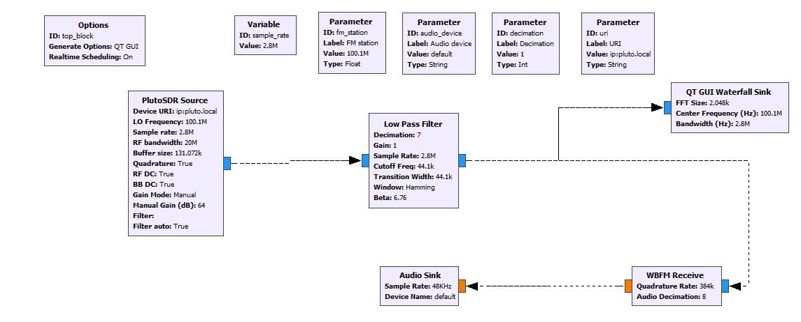
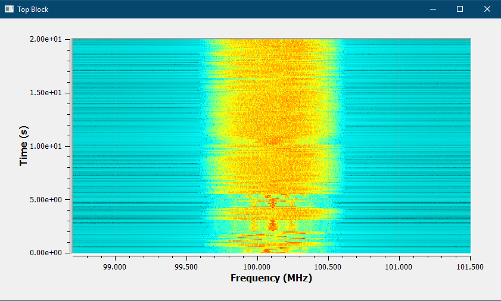

# FM Receiver with Pluto

Author : Jay Patel , Dalhousie University, NS, Canada.

Software Requirement :

      1. GNU Radio software with IIO_Support (win_64) - (https://wiki.analog.com/resources/tools-software/linux-software/gnuradio_windows) 
      
    Hardware :
      
      1. ADM-Pluto SDR Active Learning Module

This is real time FM Receiver with Pluto SDR. 

**This version is tested for GNURadio 3.8**
----------------------------------------------
1. Just download the files from source folder and open fmradio_pluto_3.8.grc in GNU Radio application. You will see something like this:

 

2. Run the file or press F5. It will open the real time FM station (in my case i configure to receive 100.1 MHz station, Halifax, NS, Canada). You can see real time waterfall of FM Station and also can hear the sound too. If you have problem with audio change sampling rate accordingly. 

 

**This version is tested for GNURadio 3.7**
----------------------------------------------
1. Just download the files from source folder and open fmradio_pluto.grc in GNU Radio application. You will see something like this:

 

2. Run the file or press F5. It will open the real time FM station (in my case i configure to receive 100.1 MHz station, Halifax, NS, Canada). You can see real time waterfall of FM Station and also can hear the sound too. If you have problem with audio change sampling rate accordingly. 

 
