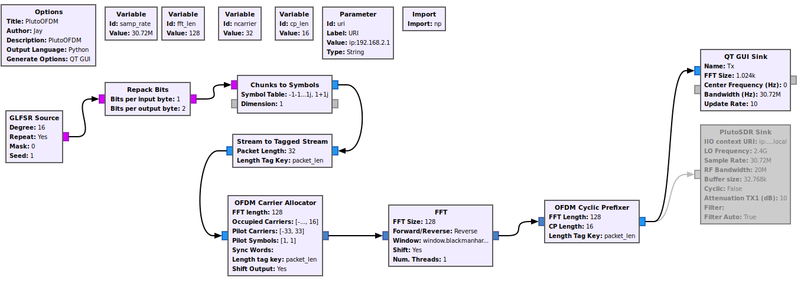
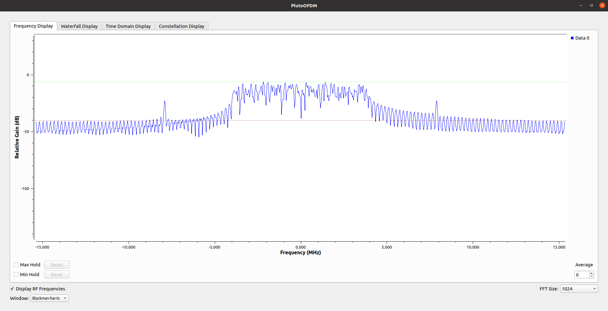

# OFDM with Pluto

Author : Jay Patel , Dalhousie University, NS, Canada.

**This version is tested for GNURadio 3.8**
----------------------------------------------
1. Just download the file PlutoOFDMGNURadio.grc in GNU Radio application. You will see something like this:

 

2. Run the file or press F5. 

**QT Display**
 
 

