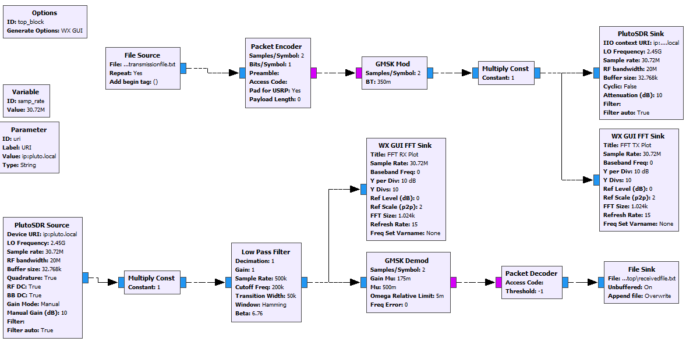
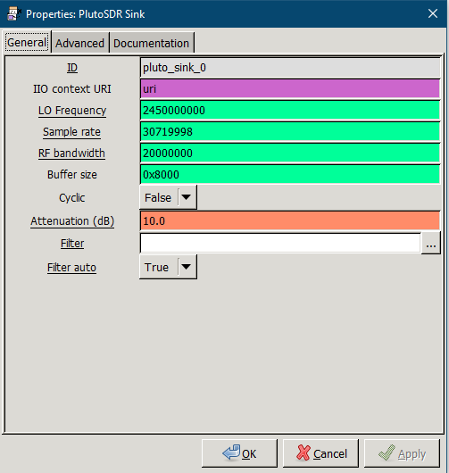
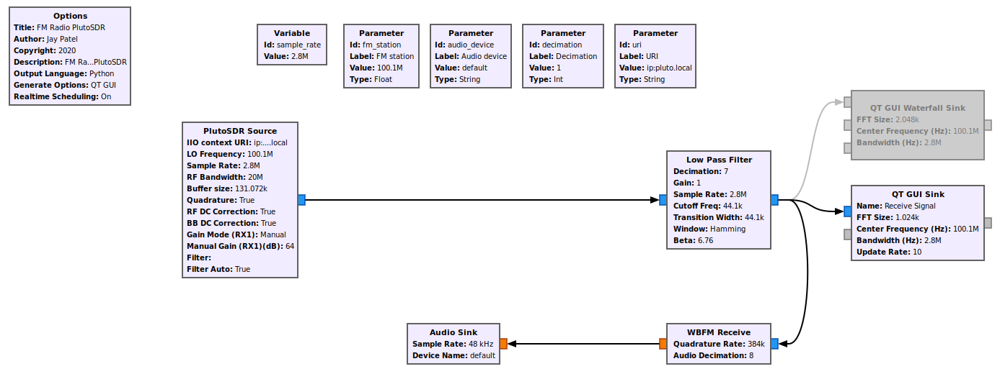
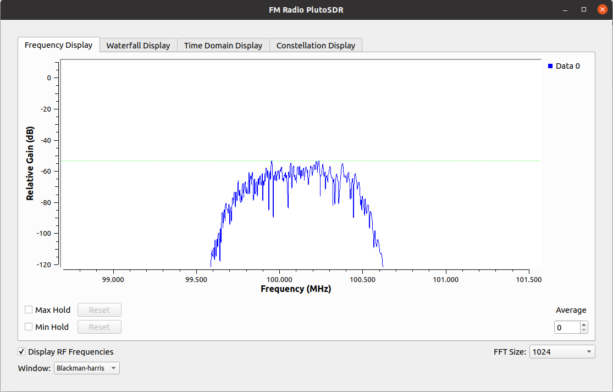
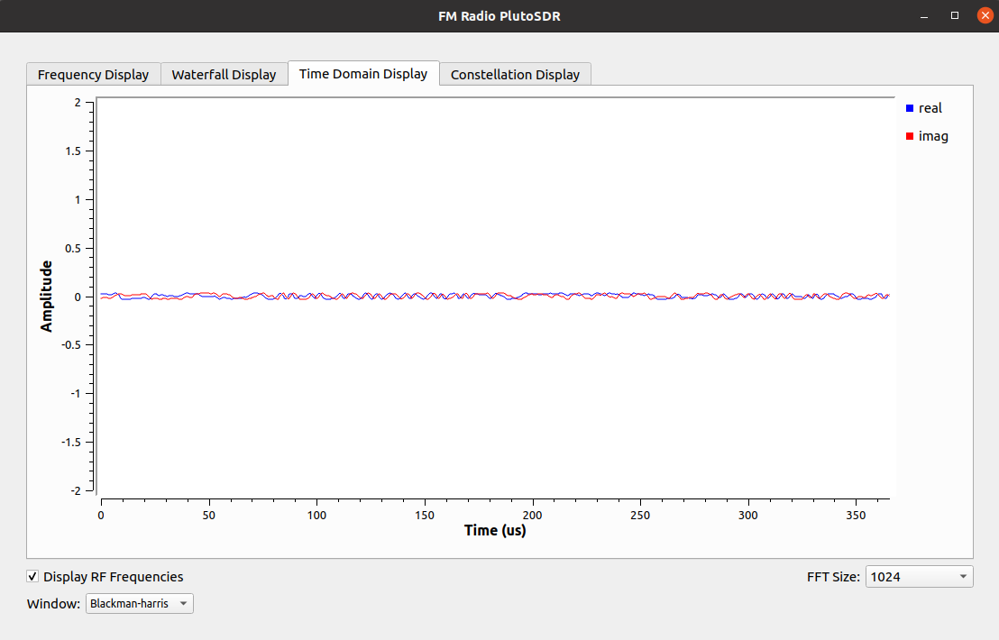
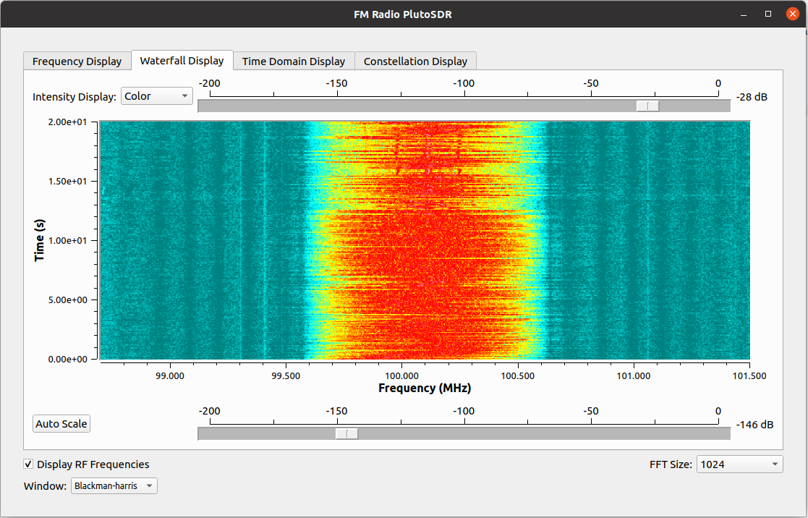

# ADM-Pluto-File-Transfer & FM Receiver PlutoSDR
File Transfer Example with ADM Pluto SDR

Author : Jay Patel , Dalhousie University, NS, Canada.

    Software Requirement :

      1. GNU Radio software with IIO_Support (win_64) - (https://wiki.analog.com/resources/tools-software/linux-software/gnuradio_windows) 
      
    Hardware :
      
      1. ADM-Pluto SDR Active Learning Module
      
Steps to perform :

1. Please make sure your pluto sdr connected properly and found from iio, To make sure please perform following command on terminal

       iio_info -s
       
 You should have something like this in your command prompt:
 
 
       
2. If you found your pluto successfully, Go ahead and open GNU Radio on your computer and open FileTxRx.grc and run the file.(Assuming you know how to run the file in GNU Radio, If not please look for Play arrow in the GNU Radio or press F5).

3. You may have to provide text file path again in GNU Radio in File Source and File Sink Block. You can use any text file for transmission. You can use the same text file from here - transmissionfile.txt (Please put this file on desktop and browse the same from File source block.)

 

4. Open transmissionfile.txt and review the contents in the file.

5. Make new text file on your desktop and name whatever you want but make sure you have same file extension. (you can also use file here name receivedfile.txt, This may have data in it, Please go aheah and delete all data from file and save that file again, Make it blank so you can see after transmission what data did you receive from Pluto).

6. While transmission, you can also see the Python based WX GUI For FFT TX and FFT Rx.

If you come across an error on GNU Radio saying that RuntimeError: Unable to set BB rate, Please make sure you provide correct sampling rate in PlutoSDR blocks in GNU Radio. If you don't know how to find out correct sampling rate, Please perform following command on your command prompt and it will give you exact sampling rate.

        iio_attr -u <uri> -c cf-ad9361-lpc voltage0 sampling_frequency_available
        
 You should have something like this in your command prompt:
 
 
        
P.S. If you have more than one sampling rate, try each one and see what is the difference.

 
 
 
# FM Receiver with Pluto

**This version is tested for GNURadio 3.8**
----------------------------------------------
1. Just download the files from source folder and open fmradio_pluto_3.8.grc in GNU Radio application. You will see something like this:

 

2. Run the file or press F5. It will open the real time FM station (in my case i configure to receive 100.1 MHz station, Halifax, NS, Canada). You can see real time waterfall of FM Station and also can hear the sound too. If you have problem with audio change sampling rate accordingly. 

**Frequency Display**
 
 
 **Time Domain Display**
 
 
 **Waterfall Display**
 
 
 **Constellation Display**
 

**This version is tested for GNURadio 3.7**
----------------------------------------------
1. Just download the files from source folder and open fmradio_pluto.grc in GNU Radio application. You will see something like this:

 

2. Run the file or press F5. It will open the real time FM station (in my case i configure to receive 100.1 MHz station, Halifax, NS, Canada). You can see real time waterfall of FM Station and also can hear the sound too. If you have problem with audio change sampling rate accordingly. 

 

